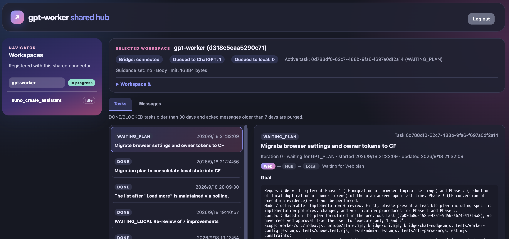

# gpt-worker

**This is an experimental project. Use at your own risk.**

**Stop Copy-Pasting ChatGPT Web Text into AI Agents**

When you instruct AI agents like Codex, Claude Code, or Antigravity with "Plan with gpt-worker" or "Review with gpt-worker", the web version of ChatGPT opens and automatically executes the investigation tasks. Once the results reach the agent, implementation begins. gpt-worker acts as a message hub in this workflow.


**gpt-worker** is a developer workflow tool designed to ease your coding agent's 5-hour and weekly usage limits. It uses the web version of ChatGPT as the planning and review "brain", while pairing with local coding agents (such as Claude Code, Antigravity, or Codex) or yourself as the execution "hands" to edit files and run tests.

Supported ChatGPT plans include Plus, Business, Pro, or any plan supporting Projects, Developer mode, and custom MCP connectors.

This tool was inspired by [XiaoDuoYa/codex-with-chatgpt](https://github.com/XiaoDuoYa/codex-with-chatgpt). It achieves integration between ChatGPT Web and a local bridge via a message hub on Cloudflare Workers, streamlined specifically for macOS and Google Chrome to keep it compact.
Special thanks to XiaoDuoYa for providing this brilliant idea.

```text
[ChatGPT Project] ⇄ (MCP / HTTPS) ⇄ [Cloudflare Worker (Shared Hub)] ⇄ (WebSocket) ⇄ [Local Environment (Bridge)]
```

---

## Key Features

- **Put Your Web Subscription to Work**: Leverages your existing ChatGPT subscription (Plus, Business, Pro, etc.) to ease 5-hour and weekly usage limits on coding agents like Codex while you develop.
- **One-Time Setup Hub**: Deploy the relay Cloudflare Worker and configure ChatGPT once. Every subsequent project is added instantly with a single local command.
- **Read-Only Workspace Access**: ChatGPT can inspect repository data and propose plans (read-only), but cannot edit files or run local commands. All code modifications and test executions are carried out and verified locally.
- **Automatic Secret Protection**: Sensitive files such as `.env`, private keys, `.ssh`, `.aws`, and Git-ignored paths are automatically hidden from ChatGPT, and every tool result is additionally scanned by an external secret scanner (betterleaks/gitleaks) before it reaches ChatGPT, with any finding masked in place.
- **Whole-Project Snapshot**: ChatGPT can ask for the project's readable text files as one archive (`workspace_bundle`) instead of reading them one at a time. It follows the same read rules as everything else and is secret-scanned before it is packed. See [Giving ChatGPT the Whole Project at Once](#giving-chatgpt-the-whole-project-at-once-workspace_bundle).
- **Chrome Automation**: Automatically opens the ChatGPT Project in Chrome when a task is queued, and can submit messages in the background without stealing window focus.
- **Web Dashboard**: Your Worker also serves a browser dashboard to inspect task history, check queued messages, edit guidance/limits, and queue new tasks without touching the CLI — either for a single workspace or across all registered projects. See [Web Dashboard](#web-dashboard).
- **No npm Runtime Dependencies**: Built entirely with Node.js standard libraries — no bulky npm packages or background services to manage (an external secret scanner like betterleaks is required as a prerequisite).

---

## Prerequisites

- **OS**: macOS (for automated Chrome integration)
- **Node.js**: v22 or higher (install with `brew install node` if not present)
- **Git**: required. The inspection tools read repository state through it, and the local bridge denies reading any file it cannot confirm is not Git-ignored — so a workspace where `git` is missing or cannot open the repository cannot be read.
- **Google Chrome**: Browser used to run ChatGPT
- **ChatGPT Account**: Plus, Business, or Pro (any plan where Projects, Developer mode, and custom MCP connectors are available; verified on Plus by the maintainer)
- **Cloudflare Account**: Free tier is sufficient (used to deploy the relay Worker)
- **A secret scanner**: [betterleaks](https://github.com/betterleaks/betterleaks) (recommended) or [gitleaks](https://github.com/gitleaks/gitleaks) as a compatible fallback — required so the local bridge can mask secrets before they reach ChatGPT; `gpt-worker start` refuses to run without one.
  ```bash
  brew install betterleaks   # or: brew install gitleaks
  ```

---

## Initial Setup (One-Time)

Setup takes 5 steps. Once completed, the same configuration is reused across all your projects.

### Step 1: Clone the Repository & Link the Command

1. Clone the repository into any working directory:
   ```bash
   git clone https://github.com/Nihondo/gpt-worker.git
   cd gpt-worker
   ```

2. Create a symlink in a directory that is in your `PATH` (such as Homebrew's bin):
   ```bash
   # Link into Homebrew's bin directory (/opt/homebrew/bin on Apple Silicon):
   ln -s "$(pwd)/bin/gpt-worker" "$(brew --prefix)/bin/gpt-worker"
   ```
   > **Tip**: On Apple Silicon Macs, you can link directly to `/opt/homebrew/bin/gpt-worker` (or `/usr/local/bin` on Intel Macs). Using `$(brew --prefix)/bin` automatically resolves the correct path for your system. Any directory in your `PATH` (e.g. `~/.local/bin`) works as well.

### Step 2: Register the Skill for Your Agent (SKILL.md)

Link `SKILL.md` into your coding agent's skills directory so the agent can discover and operate `gpt-worker`:

```bash
# Example: For Claude Code
mkdir -p ~/.claude/skills/gpt-worker
ln -s "$(pwd)/SKILL.md" ~/.claude/skills/gpt-worker/SKILL.md

# Example: For Codex
mkdir -p ~/.codex/skills/gpt-worker
ln -s "$(pwd)/SKILL.md" ~/.codex/skills/gpt-worker/SKILL.md

# Example: For Antigravity
mkdir -p ~/.agents/skills/gpt-worker
ln -s "$(pwd)/SKILL.md" ~/.agents/skills/gpt-worker/SKILL.md
```

> **Optional: Run as a Subagent (Claude Code & Codex CLI):**  
> By default, calling the skill runs directly inside your active chat session. This means the session stays occupied while waiting for ChatGPT (up to 15 minutes), and intermediate step logs accumulate in your conversation context.  
> If you prefer to **keep your main conversation free during waits** and **prevent step-by-step logs from cluttering your context**, you can run the entire loop as a background subagent by linking the agent definitions below:
> ```bash
> # Claude Code
> mkdir -p ~/.claude/agents
> ln -s "$(pwd)/.claude/agents/gpt-worker.md" ~/.claude/agents/gpt-worker.md
>
> # Codex CLI
> mkdir -p ~/.codex/agents
> ln -s "$(pwd)/.codex/agents/gpt-worker.toml" ~/.codex/agents/gpt-worker.toml
> ```
> Once linked, simply ask for it by name (e.g., "run this with the gpt-worker agent"). (Note: Codex custom agents are an evolving feature; if your Codex CLI version cannot load the TOML file, fall back to the standard skill above.)

### Step 3: Initialize & Deploy the Worker

Run `init` targeting your first project directory:

```bash
gpt-worker init -w /path/to/your-project
```

- On the first run, a browser window opens for Cloudflare login.
- Once authenticated, the Cloudflare Worker deploys automatically.
- Note the `Server URL` printed in the terminal (you can check it anytime with `gpt-worker url`).

### Step 4: Configure ChatGPT

1. **Enable Developer Mode**:
   - In ChatGPT, open **Settings** → **Apps / Developer mode** (the exact location in Settings varies by current ChatGPT UI and workspace type) and toggle Developer mode ON.
2. **Add MCP Connector**:
   - Go to **Settings** → **Connectors** (or **Apps** / Developer mode settings) and add a new connector.
   - **Name**: `gpt-worker` (fixed — do not rename)
   - **Server URL**: The URL printed by `gpt-worker url`
   - **Authentication**: Select `OAuth`. When the consent page appears, enter the owner token printed by `gpt-worker url` to approve it.
   - **Choose a connector URL**:
     - **Shared connector (recommended)**: `gpt-worker url` prints `/mcp`. Register it once to use every registered workspace. ChatGPT selects a workspace with `list_workspaces` and supplies its `workspace_id` to later tool calls.
     - **Dedicated workspace connector**: `gpt-worker url -w /path/to/your-project` prints `/mcp/<workspace_id>`. Register it as a separate connector when it should access only that workspace. It does not provide `list_workspaces`, and its tool calls do not need a `workspace_id`.
3. **Create a ChatGPT Project**:
   - In ChatGPT's left sidebar, create a **New Project** (e.g., `Coding Assistant`).
   - We recommend enabling **Project-only memory** in the project settings.
4. **Set Project Instructions**:
   - Paste this single line into the project's **Instructions** field.
     ```text
     Use the gpt-worker connector. It supplies its own operating instructions — follow them for every round.
     ```
   - The full operating protocol is delivered to ChatGPT automatically by the connector, so there is nothing else to paste and no need to re-paste when gpt-worker is updated.
   - Leaving the field empty also works, but the line above ensures ChatGPT picks up the connector protocol smoothly on the very first turn of a new conversation.
   - The protocol text itself lives in [worker/src/instructions.md](worker/src/instructions.md) if you want to read it.

### Step 5: Register the Project URL & Enable Chrome Auto-Submit

1. Save your ChatGPT Project URL (from the browser address bar `https://chatgpt.com/g/...`) into the CLI:
   ```bash
   gpt-worker chat-url "https://chatgpt.com/g/g-p-.../project"
   ```
   When configured, Chrome will prepare and, when Apple Events is enabled, submit task prompts automatically.

2. **Allow Chrome Background Submission (One-Time Setup)**:
   To enable background prompt typing and submission without stealing window focus, enable Apple Events scripting in Chrome:
   - In Chrome's menu bar, click **View** → **Developer** → check **Allow JavaScript from Apple Events**.
   - **Relaunch Chrome completely** (`Cmd + Q` to quit, then reopen).
   > **Note**: If this setting is not enabled, the prompt will be placed into the composer, but you will need to press Enter manually.


---

## Daily Usage (Workflow Cycle)

> **💡 Routine work only requires prompting your agent**  
> Once `SKILL.md` is installed, simply tell your agent (Claude Code, Codex, Antigravity, etc.) to "**plan this with gpt-worker**" or "**run this with ChatGPT review**". It follows the loop below on its own, running the CLI commands shown at each step.  
> In most cases, **you do not need to run commands manually**.  
> (The manual steps below remain fully available if you wish to run commands directly or inspect what is happening. On Claude Code or Codex CLI, "run this with the gpt-worker agent" instead runs the same loop as a subagent — see [Step 2](#step-2-register-the-skill-for-your-agent-skillmd).)

Development follows an iterative cycle: **"Task (`task`) → Wait (`wait`) → Edit & Test → Report (`report`) → Review (`wait`)"**.

```text
[You / Local Agent]                             [ChatGPT]
        │                                           │
        │── 1. gpt-worker task "<goal>" ───────────>│
        │                                           │ (Inspects repo & drafts plan)
        │<── 2. gpt-worker wait (Receive PLAN) ─────│
        │                                           │
   (Edit code & run tests locally)                  │
        │                                           │
        │── 3. gpt-worker report ──────────────────>│
        │                                           │ (Reviews diff & verifies tests)
        │<── 4. gpt-worker wait (DONE or next step) │
```

### 1. Start the Bridge Process
Before starting work, ensure the local bridge process is running for your workspace:

```bash
gpt-worker start -w .
gpt-worker status -w .
```
> 💬 *You normally don't need to say this — your agent checks and starts the bridge on its own the moment you ask it to do anything with gpt-worker.*

### 2. Queue a Task (`task`)
Describe your goal in natural language:

```bash
gpt-worker task "Fix the validation error styling on the login page" -w .
```
> 💬 **In chat:** "Plan this with gpt-worker: fix the validation error styling on the login page"

Chrome opens your ChatGPT Project, and the task prompt is automatically entered and submitted (requires the Chrome "Allow JavaScript from Apple Events" setting described above).

### 3. Wait for the Plan (`wait`)
ChatGPT inspects workspace files and prepares a plan:

```bash
gpt-worker wait -w .
```
> 💬 *This runs automatically right after the request above — nothing to say separately unless you're resuming a stalled session (see [Resuming After a Timeout](#resuming-after-a-timeout)).*

When received, the plan is printed in the terminal. Review it to ensure it is sound and safe.

### 4. Execute Changes & Run Tests
Your local agent (Claude Code, Antigravity, etc.) or you modify the code and run your test suite locally.

### 5. Report Results (`report`)
Report modified file counts and test results back to ChatGPT:

```bash
gpt-worker report --changed 2 --tests "All 8 tests passing" -w .
```
> 💬 **In chat:** "Report the changes to ChatGPT for review"

### 6. Receive Review Results (`wait`)
Run `wait` again to receive ChatGPT's evaluation:

```bash
gpt-worker wait -w .
```
> 💬 *Automatic, same as step 3.*

If ChatGPT determines the goal is achieved (`DONE`), you are finished! If there are follow-up instructions, repeat from step 4.

### 7. Stop the Bridge Process
When finished, stop the local bridge process:

```bash
gpt-worker stop -w .
```
> 💬 *External tool requests are blocked whenever no active task is running, so leaving the process running is safe.*

---

## Common Tasks & Recipes

### Starting a New Chat & Managing Conversation Threads
gpt-worker remembers the ChatGPT conversation thread (URL) for each workspace so it can seamlessly continue the discussion in the same thread.  
If a conversation becomes too long and sluggish, if you want a clean slate for a new feature, or if you want to switch to a conversation you opened manually in your browser, use the following commands:

```bash
# Start a fresh conversation thread in the same Project for future tasks/reports
gpt-worker chat new -w .

# Attach the workspace to a specific conversation thread opened manually in your browser
gpt-worker chat attach "https://chatgpt.com/g/g-p-.../c/..." -w .

# Inspect the configured Project and currently attached conversation thread
gpt-worker chat status -w .
```
> 💬 **In chat:** "Start a fresh ChatGPT conversation for this project" — or "Attach this project to the ChatGPT conversation at &lt;url&gt;" — or "Which ChatGPT conversation is this project attached to?"

### Adding Another Project
No need to redeploy the Worker or reconfigure ChatGPT. Simply run `init` in the new directory:

```bash
gpt-worker init -w /path/to/another-project
```
> 💬 **In chat:** "Set up gpt-worker for this project too"

### Setting Project-Specific Guidelines (`guidance`)
Set standing rules for ChatGPT (e.g., "Always use Vitest", "Enforce strict TypeScript"):

```bash
# Set standing guidance
gpt-worker guidance "Always write tests in Vitest. Prefer functional components." -w .

# View current guidance
gpt-worker guidance -w .

# Clear guidance
gpt-worker guidance --clear -w .
```
> 💬 **In chat:** "Set standing guidance for gpt-worker on this project: always write tests in Vitest, prefer functional components" — or "Clear the gpt-worker guidance for this project."

### Managing Read Permissions (allow-read and deny-read)
By default, files listed in `.gitignore` cannot be read by ChatGPT, while normal tracked files can be read. You can configure granular read policies using `allow-read` and `deny-read`:

- **Policy priority**: Sensitive files (`.env`, private keys, etc.) > `deny-read` > `.gitignore` baseline (with `allow-read` exceptions). Sensitive paths can never be read.
- **`allow-read <path>`**: Explicitly allows direct MCP `read_file` calls for a Git-ignored file or directory. Directory contents remain hidden from listing and search.
- **`unallow-read <path>`**: Removes an `allow-read` exception.
- **`deny-read <path>`**: Explicitly denies reads for any file or directory (whether tracked or previously allowed). Denied paths are completely hidden from listing, search, and direct reads.
- **`undeny-read <path>`**: Removes an explicit deny rule. If the path was also allowed, the underlying allow-read exception becomes active again.

```bash
# Allow reading a Git-ignored file or directory
gpt-worker allow-read config/test-fixture.json -w .
gpt-worker allow-read fixtures -w .

# List allowed paths
gpt-worker allow-list -w .

# Remove an allow-read exception
gpt-worker unallow-read config/test-fixture.json -w .
gpt-worker unallow-read fixtures -w .

# Explicitly deny reading a normal or allowed path
gpt-worker deny-read secret-docs -w .
gpt-worker deny-read config/internal.json -w .

# List denied paths
gpt-worker deny-list -w .

# Remove an explicit denial
gpt-worker undeny-read secret-docs -w .
gpt-worker undeny-read config/internal.json -w .
```
*Note*: `gpt-worker status` displays both `read allowed` and `read denied` paths. Sensitive files (`.env`, `.ssh/`, private keys) cannot be unblocked by either list.

> [!NOTE]
> **Compatibility note**: Prior versions of `gpt-worker` used `deny-read` to revoke an `allow-read` exception. That operation is now `unallow-read`. `deny-read` now creates an independent, persistent deny rule that can target any path (including normal tracked files). Existing `read-allowlist.json` entries are preserved.

### Giving ChatGPT the Whole Project at Once (`workspace_bundle`)
Instead of reading files one by one, ChatGPT can call `workspace_bundle` to receive the project's readable text files as a single `.tgz` archive, which it opens in its own sandbox and reads selectively. This saves many round trips on a task that needs broad context. You do not run it yourself; ChatGPT calls it when it needs it.

- **Same rules as every other read**: only what ChatGPT could already read is included. Sensitive files (`.env`, private keys, …), Git-ignored files, paths you `deny-read`, and noisy folders (`node_modules`, build output) are left out and are not named or counted. A path you `allow-read` stays direct-read only and is **not** put in the archive.
- **Secrets are masked before packing**: every secret the scanner finds is replaced with `[REDACTED:<rule>]`, and local paths are normalized to `[workspace]`/`[home]`. If a secret cannot be masked in place, that file is left out instead.
- **What is not included**: binary files, symbolic links and files over 1 MiB. `BUNDLE.md`, the first file in the archive, lists them and says whether the archive is complete.
- **Size**: 1 MiB by default, at most 4 MiB. If the project is too large ChatGPT gets an error with a per-folder breakdown and asks for a narrower `path`; nothing is cut off silently.
- **ChatGPT asks you to approve opening the archive.** The first time, ChatGPT shows a dialog ("Materialize the file?" / 「ファイルを実体化しますか？」). Choose **Allow for this conversation** (from the arrow beside Allow) so it does not ask again in that conversation; choosing plain Allow asks each time. A new conversation asks again.
  - If you **decline**, ChatGPT is told you declined and will not retry the archive; ask it to read files one by one instead.
  - If nobody answers, ChatGPT **waits indefinitely** (observed for over 15 minutes) and `gpt-worker wait` just keeps waiting. If a task seems stuck, look at the ChatGPT window for an unanswered dialog.
- Requires `tar` (present on macOS and Linux by default).

### Inspecting Configuration
Inspect configured Project URLs and auto-submit preferences:

```bash
gpt-worker show-config -w .
```
> 💬 **In chat:** "Check the ChatGPT browser settings gpt-worker has configured for this project"

### Listing Registered Workspaces
List all workspaces registered on this machine and their bridge statuses:

```bash
gpt-worker workspaces
```

### Web Dashboard



Your Cloudflare Worker also serves a browser dashboard — a kanban-style view of the queue and task history, plus the ability to ack/discard messages, edit guidance/limits, and queue a new task from the browser instead of the CLI. There are two login paths, at two different URLs:

**One workspace at a time**, with that workspace's own owner token:

```bash
gpt-worker url -w .
# WebUI URL:         https://<your-worker>.workers.dev/dashboard/<workspace_id>
# OAuth Server URL:  https://<your-worker>.workers.dev/mcp/<workspace_id>
# OAuth owner token: <gpt_token>
```

Open the `WebUI URL` (`https://<your-worker>.workers.dev/dashboard/<workspace_id>`) and log in with that same owner token (the `gpt_token` shown above for that workspace — **not** the shared hub token; that one is rejected here). Login exchanges the token for a 24-hour browser session (an `HttpOnly`/`Secure` cookie scoped to that workspace's own dashboard path) — the owner token itself is never sent again after that.

**Every registered workspace at once**, with the shared hub token:

```bash
gpt-worker url
# WebUI URL:         https://<your-worker>.workers.dev/dashboard/hub
# OAuth Server URL:  https://<your-worker>.workers.dev/mcp
# OAuth owner token: <hub_gpt_token>
```

Open the `WebUI URL` (`https://<your-worker>.workers.dev/dashboard/hub`) and log in with that shared hub token (**not** a single workspace's `gpt_token`; that one is rejected here). After login you get a workspace picker listing every workspace registered with this shared connector (the same set `gpt-worker init` adds you to and `list_workspaces` shows ChatGPT); selecting one gives you the exact same view/actions as that workspace's own dashboard above. The two logins are entirely separate sessions — a workspace session can't reach the hub dashboard and a hub session can't directly authenticate a workspace's own dashboard URL — and the hub only ever reaches a workspace_id it has registered, never an arbitrary one.

Capabilities and behavior:
- **Can do**: browse pending messages and full task exchange history with timestamps, ack or discard messages, view and edit guidance or body limits, view/edit/clear browser settings (shared ChatGPT Project URL, workspace override, conversation URL), start new tasks from the browser (available from both the per-workspace and hub dashboards).
- **MCP Access history**: the **MCP Access** tab (next to Tasks and Messages) shows what ChatGPT did through the MCP connector — see [MCP Access history](#mcp-access-history) below.
- **Real-time updates**: supports real-time push updates over WebSocket, immediately reflecting task progress, message exchanges, and setting changes in the browser (automatically falls back to adaptive polling — ~30s while active, ~2m when idle, ~60s for the Hub workspace list — if the WebSocket disconnects, and pauses updates while the tab is hidden).
- **Data retention**: follows standard Worker policies (an acked message is removed after 7 days, and completed task history after 30 days). MCP access history is kept for 24 hours, at most 1000 calls per workspace.

A workspace's own dashboard session is revoked immediately if you rotate that workspace's owner token (`gpt-worker rotate --gpt -w .`) or remove the workspace (`gpt-worker remove -w . --yes`). A hub dashboard session is revoked immediately if you rotate the shared hub token (`gpt-worker rotate --hub`) — see [Data Retention](#data-retention).

#### MCP Access history

The **MCP Access** tab lists every tool call ChatGPT made through the connector, newest first, so you can see what it read (or tried to read) and why something was refused. Each row shows:

- **What**: a plain-language tool name (Read file, Git diff, Search, Batch, …) with the raw tool name beneath it.
- **Target**: the file or directory path, or a fixed description such as "workspace search" or "PLAN · iteration 2".
- **Result**, as a text badge (never color alone): **OK**, **Blocked** (no active task, or the read window closed — see *Time-Bounded Access*), **Denied** (a sensitive, Git-ignored, or out-of-workspace file), **Error**, or **Mixed** (a batch with different outcomes; open it to see each call).
- **Time taken** and the **task** it belonged to.

To keep the list readable, consecutive successful file reads of the same task (within 30 seconds of each other) fold into one "Read file × N" row. Denials, blocks, and errors are never folded. Untick **Group repeated reads** to see every call. The **Tool** and **Result** filters apply to the whole history, not just the loaded page — use **Load more** to go further back. The tab works the same in the per-workspace and hub dashboards.

What is recorded — and what never is: only metadata (time, tool, connector, task ID, a safe target, result class, a short reason code, duration). **File contents, diffs, search queries or hits, message bodies and titles, error text, raw tool arguments/results, secrets, and absolute paths are never stored.** Paths that would point outside the workspace are shown as a fixed label instead. This is an audit trail of *access*, not a copy of what was accessed.

The default timeout for `wait` is 15 minutes. If a timeout occurs, you can resume waiting without re-submitting the task:

```bash
# Check current task state
gpt-worker state -w .

# Resume waiting
gpt-worker wait -w .
```
> 💬 **In chat:** "Check if ChatGPT has replied yet" — your agent runs `state` then `wait` as needed.

### Handing a Task to Another Agent
When the agent you are working with has to stop mid-task — a rate limit is close, or the session is ending — it can hand the task to a different agent instead of finishing the round normally:

```bash
gpt-worker handoff --changed 3 --tests "unit tests pass; integration not run" --reason "rate limit" -w .
```
> 💬 **In chat:** "Hand this off to ChatGPT — I'm running low on my rate limit"

The agent then stops, without waiting. ChatGPT writes a handoff brief carrying the task's history — the goal, what is done, the decisions and the approaches already ruled out — and queues it. A different agent picks it up later with the ordinary wait command:

```bash
gpt-worker wait -w .
```

The brief stays in the queue for 7 days, so the second agent can start whenever you like — a different model, a different session, or the same machine tomorrow. Nothing needs to be copied between the two agents: the Worker retains the task state, allowing the resuming agent to take over without any direct handoff from the previous session.

What carries over is the context ChatGPT itself accumulated while planning and reviewing. Because ChatGPT stays on the task while the local agents change, the review after the handoff still accounts for the work done before it.

**If the previous agent never got to run `handoff`** — it was abruptly cut off without stopping cleanly — a new agent can run `handoff` itself to claim the task. The `handoff` command works in either direction, and neither ChatGPT nor the Worker needs to distinguish which agent called it:

```bash
gpt-worker handoff --reason "previous agent stopped without reporting; taking over" -w .
```
> 💬 **In chat:** "Take over this task from the previous agent — it stopped without reporting"

Skip `--changed`/`--tests` (or say plainly that nothing is verified) rather than guessing at work you did not do — ChatGPT re-checks the repository itself (`git_status`/`git_diff`) before trusting any report anyway. This only works while the task is still mid-round; if it fails, a reply may already be queued — run `gpt-worker wait` instead. Otherwise, follow it with `gpt-worker wait` to receive the brief.

If a handoff brief doesn't fit in the message size limit (16 KB by default), raise it for that workspace:

```bash
gpt-worker limits 65536   # bytes; run with no argument to see the current value
gpt-worker limits --reset # back to the default
```
> 💬 **In chat:** "Raise gpt-worker's message size limit for this project to 64 KB" — or "Reset gpt-worker's message size limit to the default."

Every message — from either side — lands in the same long-lived ChatGPT conversation this workspace reuses across tasks, so raise this deliberately: a larger cap means faster growth toward that conversation's context limit, not a free allowance.

### Updating & Redeploying
When you update gpt-worker via `git pull`, redeploy the Cloudflare Worker if the update includes changes to the Worker code (`worker/`):

```bash
# 1. Navigate to the gpt-worker repository and pull the latest changes
cd /path/to/gpt-worker
git pull

# 2. Redeploy the Cloudflare Worker
npm run deploy

# 3. Restart any running local bridge processes
gpt-worker stop -w /path/to/your-project
gpt-worker start -w /path/to/your-project
```
> **Note**:
> - Redeploying preserves your Worker URL and existing authentication tokens, so you do not need to reconfigure ChatGPT connectors.
> - If an update only modifies local bridge code (`bridge/`), Worker redeployment is not strictly necessary, but running `npm run deploy` is always safe.
> - ChatGPT also keeps using a connector's earlier tool definitions. If an update adds or changes a tool's arguments or description (for example `workspace_bundle`'s `path`), refresh the connector in ChatGPT's settings; until then ChatGPT validates calls against the old definition and rejects new arguments.
> - ChatGPT caches a connector's `initialize` response at registration time, so an update to the operating instructions only reaches an already-registered connector once you remove and re-add it. You don't need to do this for every deploy: the same instructions are also delivered via `next_task` (on the first task or whenever instructions change, via version handshake) and through the `operating_instructions` tool, so a round works correctly either way.

### Deregistering a Workspace
To remove a project and purge its records from the local machine and remote Worker:

```bash
gpt-worker remove -w /path/to/project --yes
```

---

## Troubleshooting & Safety

### Chrome Auto-Submit Not Working
To allow background script execution in an existing tab:

1. In Chrome, open **View** → **Developer** → check **Allow JavaScript from Apple Events**.
2. **Relaunch Chrome completely**.
3. Any existing text or draft in the input box (including connector mentions) is cleared and overwritten with the new prompt to prioritize uninterrupted background execution.

### Safety Guarantees
- **Plan Review**: Always verify the plan generated by ChatGPT before execution. Check for unwanted file deletions or unexpected external commands.
- **Secret Blocking**: `.env`, private keys, `.ssh`, and `.aws` are always blocked from ChatGPT read requests.
- **Time-Bounded Access**: ChatGPT can only inspect workspace files while an active task is running.

### Data Retention
Your Cloudflare Worker (deployed to your own account in Step 3) retains task traffic for a limited period, which means some temporary data is stored remotely compared to a purely local setup:
- **Task message bodies** (goal text, plans, execution reports) are automatically deleted from the Worker 7 days after being delivered and acknowledged.
- **Task history** (goal text and outcome summary, used to give ChatGPT context on past tasks) is automatically deleted from the Worker 30 days after the task reaches a final outcome (done or blocked). An in-progress task is never deleted while it's active.
- **MCP access history** (metadata only — see [MCP Access history](#mcp-access-history)) is deleted 24 hours after each call, and only the newest 1000 calls per workspace are kept. It is removed with the workspace by `gpt-worker remove`.
- **[Web dashboard](#web-dashboard) sessions** expire after 24 hours and are then swept automatically; a workspace's own dashboard session is also revoked immediately by rotating that workspace's owner token or removing the workspace, and the shared hub dashboard's session is revoked immediately by rotating the shared hub token.
- To permanently wipe all task/queue records for a workspace from your Cloudflare account, run `gpt-worker remove -w <dir> --yes` (see [Deregistering a Workspace](#deregistering-a-workspace)). There is no way to delete a single past task's history short of removing the whole workspace.

---

## Command Reference

| Command | Description |
|---|---|
| `gpt-worker init -w <dir> [--worker-url <https-url>] [--skip-preflight]` | Register workspace (deploys Worker on first run). Checks Node, Git, and the secret scanner before Cloudflare operations. `--worker-url` is an optional expected `*.workers.dev` endpoint and must match the Worker deployed by the current Wrangler project before its admin secret is set; `--skip-preflight` bypasses local checks. |
| `gpt-worker url [-w <dir>]` | Display WebUI (dashboard) URL, OAuth Server URL, and owner token (`-w` displays URLs dedicated to that workspace) |
| `gpt-worker start -w <dir>` | Start the local bridge process |
| `gpt-worker stop -w <dir>` | Stop the local bridge process |
| `gpt-worker status -w <dir>` | Check local bridge diagnostics, read-gate state, read-allowed and read-denied paths, log path, verified chat binding, Worker link, and active task details. A Worker outage is reported as unavailable rather than as an unbound chat. |
| `gpt-worker logs [-w <dir>] [-n <lines>] [--all] [--path]` | Show the last 50 local bridge log lines (including the retained rotation). `--path` prints log paths for `tail -f`; `--all` covers every locally provisioned workspace, including a workspace later moved or deleted. Does not require Worker connectivity. |
| `gpt-worker task "<goal>" [-w <dir>] [--title "<title>"]` | Queue a new task for ChatGPT |
| `gpt-worker wait -w <dir>` | Wait for ChatGPT response (PLAN / DONE / instructions) |
| `gpt-worker report [-w <dir>] [--title "<title>"]` | Submit execution metrics and test results to ChatGPT |
| `gpt-worker complete -w <dir>` | Confirm completion of a review/planning task left in LOCAL_DECISION |
| `gpt-worker continue -w <dir>` | Transition a review task in LOCAL_DECISION back to EXECUTING to implement recommendations |
| `gpt-worker handoff [-w <dir>] [--reason "<why>"] [--title "<title>"]` | End the round and hand the task to a different agent, which resumes with `wait` |
| `gpt-worker discard-task [-w <dir>] [--task <id>] --yes` | Abandon the active task: mark it BLOCKED and clear its queued messages. Not resumable, so `--yes` is required. The way out of a task stuck after `wait` exits 3 |
| `gpt-worker queue [-w <dir>] [--task <id>] [--discard <id>]` | Inspect pending queue messages or discard stuck messages |
| `gpt-worker limits [<bytes>\|--reset] [-w <dir>]` | View or change this workspace's message body size limit (default 16 KB) |
| `gpt-worker guidance "<text>" -w <dir>` | Set project-specific instructions |
| `gpt-worker chat-url "<url>" -w <dir>` | Save or inspect ChatGPT Project URL |
| `gpt-worker chat <new\|attach\|status> ... -w <dir>` | Start a fresh chat, attach a manually opened conversation, or inspect chat recovery state |
| `gpt-worker show-config [-w <dir>]` | Display browser settings without credentials |
| `gpt-worker allow-read <path> -w <dir>` | Allow reading a specific Git-ignored file or directory |
| `gpt-worker unallow-read <path> -w <dir>` | Remove an allow-read exception for a Git-ignored file or directory |
| `gpt-worker allow-list -w <dir>` | List allowed Git-ignored paths |
| `gpt-worker deny-read <path> -w <dir>` | Explicitly deny reading a file or directory |
| `gpt-worker undeny-read <path> -w <dir>` | Remove an explicit read denial for a file or directory |
| `gpt-worker deny-list -w <dir>` | List explicitly denied read paths |
| `gpt-worker state -w <dir>` | Display active task checkpoint in JSON |
| `gpt-worker rotate <--gpt\|--link\|--cli\|--hub> [-w <dir>]` | Rotate authentication tokens (workspace GPT/link/CLI token or shared hub token) |
| `gpt-worker workspaces` | List all registered workspaces |
| `gpt-worker remove -w <dir> --yes` | Deregister workspace and purge records |

Run `gpt-worker help`, `gpt-worker help <command>`, or `gpt-worker <command> --help` to see the available commands without requiring a configured workspace.

### Exit codes

| Code | Meaning |
|---|---|
| `0` | Success |
| `1` | Error (the message says what to do) |
| `2` | `wait` timed out with no reply yet — run it again |
| `3` | `wait` delivered a reply, but the task did not advance. The reply is printed; inspect with `gpt-worker state`, and if the task is truly stuck, `gpt-worker discard-task --yes` |
| `4` | The Worker could not be reached. For `task`/`report`/`handoff` the message says whether the request may still have been applied — check `gpt-worker state` before repeating it. `wait` can also exit 4 right after printing a reply whose acknowledgement could not be confirmed: follow the guidance it prints (check `gpt-worker state` and `gpt-worker queue --task <task id>`) rather than assuming a redelivery |

Commands retry transient network failures on their own (a few short attempts). `wait` goes further and keeps trying until its own timeout, so a brief outage during a long wait does not end it.

---

## Development

To run tests or deploy updates to gpt-worker itself:

```bash
npm run check    # Run syntax checks
npm test         # Run test suites
npm run coverage # Run tests with Node's built-in coverage report (not part of verify)
npm run verify   # Run check and tests
npm run dry-run  # Dry-run Worker deployment
npm run deploy   # Deploy Cloudflare Worker updates
```

---

## Acknowledgments

This project was heavily inspired by **[XiaoDuoYa/codex-with-chatgpt](https://github.com/XiaoDuoYa/codex-with-chatgpt)**, which pioneered the approach of using ChatGPT's web subscription as the reasoning brain for coding agents. Special thanks to XiaoDuoYa for this innovative concept and open-source contribution.

---

## License

[MIT](LICENSE) © 2026 Nihondo
